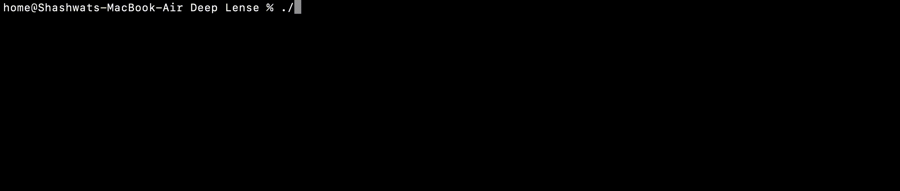
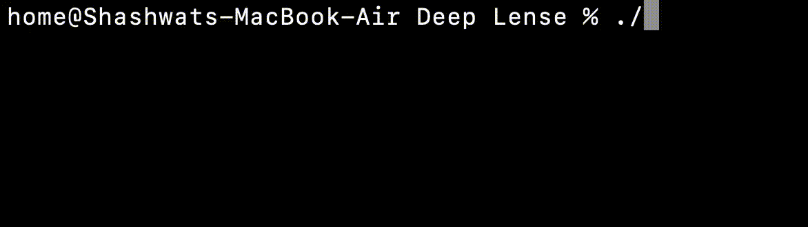
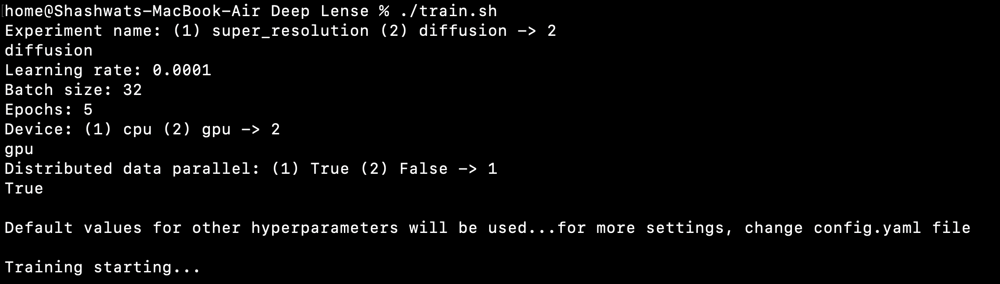
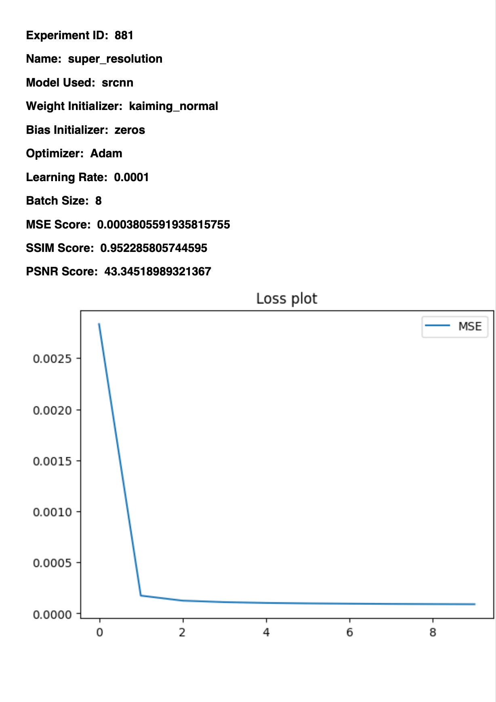

[](https://opensource.org/licenses/)
[](https://www.python.org)
[](https://jupyterlab.readthedocs.io/en/stable)
[](https://pytorch.org)


# Deep Lense

This repository is meant to combine different Deep Lense experiments by ML4Sci organization and provide an automated method to add, ammend and execute different experiments, generate reports, predictions all at one place just from the terminal (shell).
## Run Locally

Clone the project

```bash
  git clone https://github.com/Shashwat112/DeepLense
```

Go to the project directory

```bash
  cd DeepLense
```

Install dependencies

```bash
  pip install -r requirements.txt
```

For training a model

```bash
  chmod +x train.sh
  ./train.sh
```

For evaluating a model

```bash
  chmod +x eval.sh
  ./eval.sh
```


## Running Tests

To run tests, run the following command

```bash
  chmod +x test.sh
  ./test.sh
```


## Demo

### Training


### Evaluation



### Testing




## Features

- Training, testing and evaluation through terminal without much coding
- Automatic ```pdf``` report generation
- Designated buffer for checkpoints
- Pydantic data validation
- Distributed Data Parallel for multi-gpu training

#### DDP demo




## File Structure

### config

This package contains a ```config.yaml``` file and a ```struct_config``` module. Any changes in the configuration must be reflected in the ```struct_config``` module. For configuration management, ```hydra``` package has been implemented troughout the repository

All model and hyperparameter ```registers``` have been implemented in ```struct_config``` using ```pydantic``` data validation and ```dataclasses```

###  data

This package contains all the ```pipeline```, ```transforms``` and ```loader``` modules. There is also a facility to download the data by providing its url. Corresponding changes have to be made in the ```source``` module

### engine

Core processing happens in this package. It contains ```trainer```, ```evaluator``` and other modules. Any new model addition has to be added in these modules

### models 

This package contains sub-packages of different models. Each ```model``` package contains its ```architecture```, ```train_step``` and ```test_step``` modules. There is common ```units``` module which provides basic blocks like Residual, Conv, Upsample etc.

At the time of commiting this ```README.md```, this package has three model namely, ```srcnn```, ```srgan``` and ```diff_unet``` used by two experiments namely Super Resolution and Diffusion. Any additional models when added have to be registered in ```struct_config``` module

### predictions

This folder is for viewing the latest evalluated model prediction. It gets refreshed before every evaluation / prediction

### reports

This folder contains ```pdf``` reports of every experiment run which is generated automatically. The contents of this report can be ammended by changing the ```utils``` module

#### Sample report



### tests 

This package contains all the tests required for running an experiment. It includes ```config```, ```data``` and ```model``` tests. 

Any contribution to the repository needs to pass all the tests before merging with the main branch

### Shell scripts

Three shell scripts namely ```train.sh```, ```eval.sh``` and ```test.sh``` control the terminal operations.